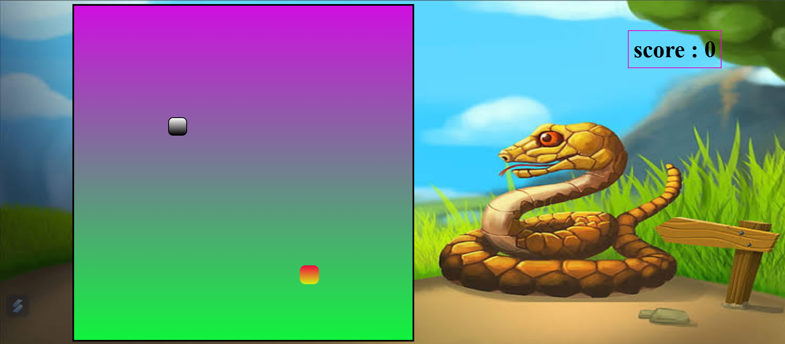

# 🐍 Snake Game Project

A classic Snake Game built using **HTML**, **CSS**, and **JavaScript** with an attractive user interface and real-time score tracking.

This project recreates the traditional snake game experience where the player controls the snake, collects food to increase the score, and avoids collisions to survive as long as possible.

## 🌐 Live Demo

🎮 Play Here:

https://pawandhobale.github.io/snake-game-project/

---

## 📸 Project Preview



> If your screenshot file has a different name, replace `snake-game-preview.png` with the actual filename.

---

## ✨ Features

- 🐍 Classic Snake Gameplay
- 📈 Real-Time Score Tracking
- 🍎 Random Food Generation
- 🎮 Keyboard Controls
- 🎨 Attractive User Interface
- ⚡ Smooth Gameplay Experience
- 🌐 Browser-Based Game
- 📱 Lightweight and Fast

---

## 🛠️ Tech Stack

| Technology | Purpose |
|------------|---------|
| HTML5 | Structure |
| CSS3 | Styling |
| JavaScript | Game Logic |

---

## 🎮 Controls

| Key | Action |
|-----|--------|
| ⬆️ Up Arrow | Move Up |
| ⬇️ Down Arrow | Move Down |
| ⬅️ Left Arrow | Move Left |
| ➡️ Right Arrow | Move Right |

---

## 📂 Project Structure

```text
snake-game-project/
│
├── index.html
├── style.css
├── script.js
├── snake-game-preview.png
└── README.md
```

---

## 🚀 Run Locally

### Clone Repository

```bash
git clone https://github.com/Pawandhobale/snake-game-project.git
```

### Open Project Folder

```bash
cd snake-game-project
```

### Run Application

Simply open:

```text
index.html
```

in your browser.

---

## 📚 Concepts Used

This project demonstrates:

- DOM Manipulation
- Event Handling
- Keyboard Events
- Collision Detection
- Dynamic Score Updates
- JavaScript Functions
- Arrays and Objects
- Game Loop Logic

---

## 🔮 Future Improvements

- High Score using Local Storage
- Pause and Resume Functionality
- Difficulty Levels
- Sound Effects
- Mobile Touch Controls
- Restart Button

---

## 👨‍💻 Author

### Pawan Dhobale

Java Backend Developer | Spring Boot | Java | JavaScript | React

GitHub Profile:
https://github.com/Pawandhobale

---

## ⭐ Support

If you found this project useful, please consider giving it a ⭐ on GitHub.
